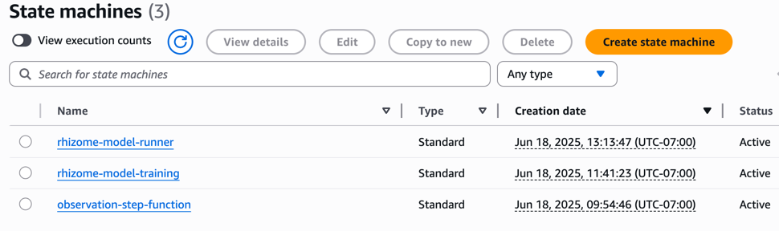
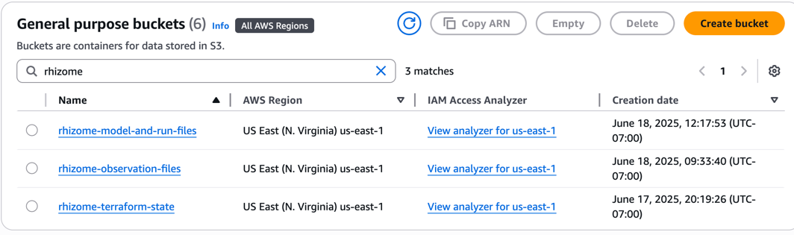
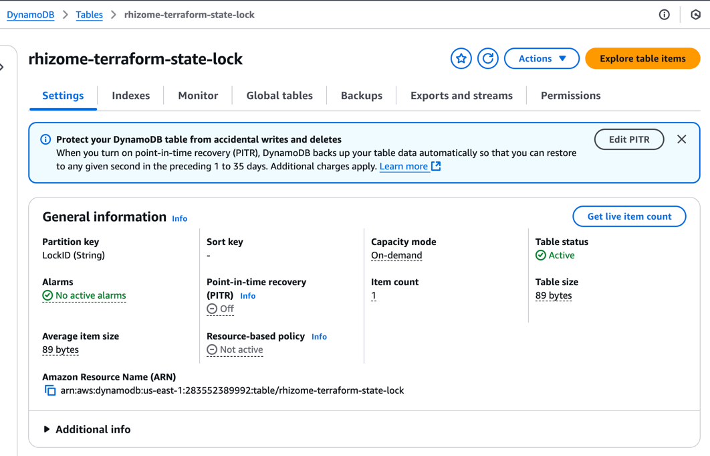
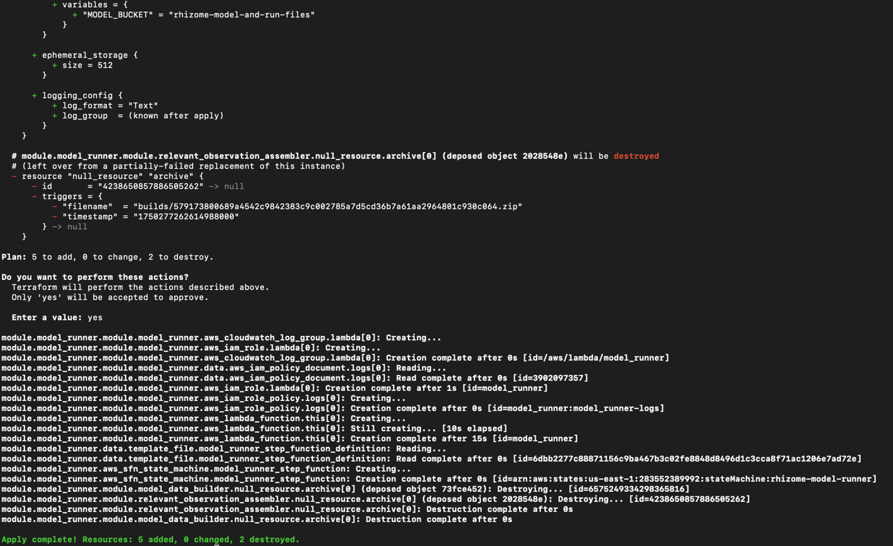
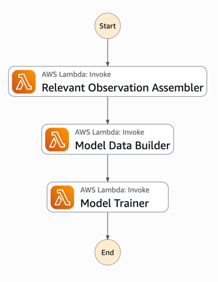
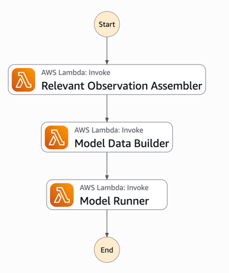
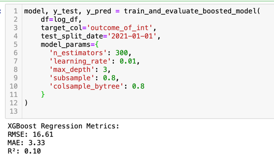
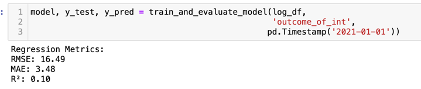

# Rhizome Assignment

There are three main components of this project:
1. **Data Pipelines** for deploying the application.
2. **model_script.py** for local demonstration of how the pipeline components fit together.
3. **Rhizome Models.ipnb** for a Jupyter notebook that contains a few model variants that improve the accuracy of the model with XGBoost and logarithmic outcomes.

## Data Pipelines
This project builds three step functions and two S3 buckets to manage the data processing and model training:

Additionally, an S3 bucket and DynamoDB table handle Terraform State. Github Actions deploys resources to AWS.

### Observations
Upload historical weather data to `s3://rhizome-observation-files/raw/<station_id>.csv` to initialize the cleaning/formatting/validation.
The `observation-step-function` will automatically trigger when new files are uploaded to '/raw/' prefix. From there, the observation files will be cleaned, validated, and stored in the `filtered/` prefix.

### Creating a Model
After you have uploaded and processed observations, you can create a model by running the `rhizome-model-training` step function.
This will train a model using:
- Relevant observation data for the location
- An `Outcome of Interest` parquet file stored in S3
- Resolution days, for controlling daily vs weekly vs monthly granularity, etc.
- Model type (e.g., `xgboost`, `random_forest`, etc.)
It stores the model in the `s3://rhizome-model-files/` bucket.
Models are stored with the following naming convention: `models/{location_name}/{run_timestamp}/model_type={model_type}/model.pkl`

### Running a Model
To run a model, you can use the `rhizome-model-run` step function. By providing the S3 URI of the model, the location, and a start and end date, this step function retrieves the relevant weather data and runs the model to produce predictions.
The predictions are stored in `models/{location_name}/{run_timestamp}/model_type={model_type}/predictions/{start_date}_to_{end_date}/predictions.parquet`

## Model Script
To see this working end-to-end locally, you can run the `model_script.py` script. It simulates the data processing and model training step function flow by using local files and prints the results to the console.
Currently, this script is using an extremely naive model. You can see predicted outputs in the `results/` directory. 

## Rhizome Models.ipnb
This Jupyter notebook contains several model variants that improve the accuracy of the model using XGBoost and logarithmic outcomes. It provides a hands-on way to experiment with different modeling techniques and see their impact on prediction accuracy.
Much more could be done to help the model capture the extreme variability of the outcome of interest.

## Remaining Work
It's perfect, isn't it? Well, not quite. There are a few outstanding tasks (as opposed to outstanding results):
- **Model Improvements**: The current model is very naive. More sophisticated models should be implemented and tested.
- **Data Validation**: The data validation step could be expanded, and a similar processing step function could be created to handle Outcome of Interest files
- **Deployment**: Terraform deployment is working locally, but Github actions got out-of-sync and I didn't have the time to sort that out.
- **Lambda Packaging**: You can package scikit-learn, xgboost, and other dependencies into a Lambda layer, but I don't have time to pull on that thread: https://github.com/model-zoo/scikit-learn-lambda
- **Documentation & Tests**: But of course!
