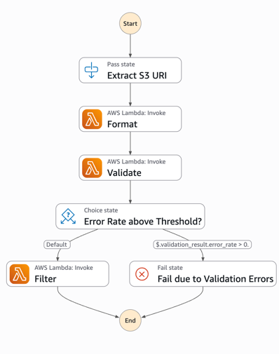

# nnielsen-rhizome-assignment

### Observations
Upload historical weather data to `s3://rhizome-observation-files/raw/<station_id>.csv` to initialize the cleaning/formatting/validation.
The `observation-step-function` will automatically trigger when new files are uploaded to '/raw/' prefix. From there, the observation files will be cleaned, validated, and stored in the `filtered/` prefix.

### Creating a Model
After you have uploaded and processed observations, you can create a model by uploading a CSV with outcomes of interest to `s3://rhizome-model-and-run-files/

